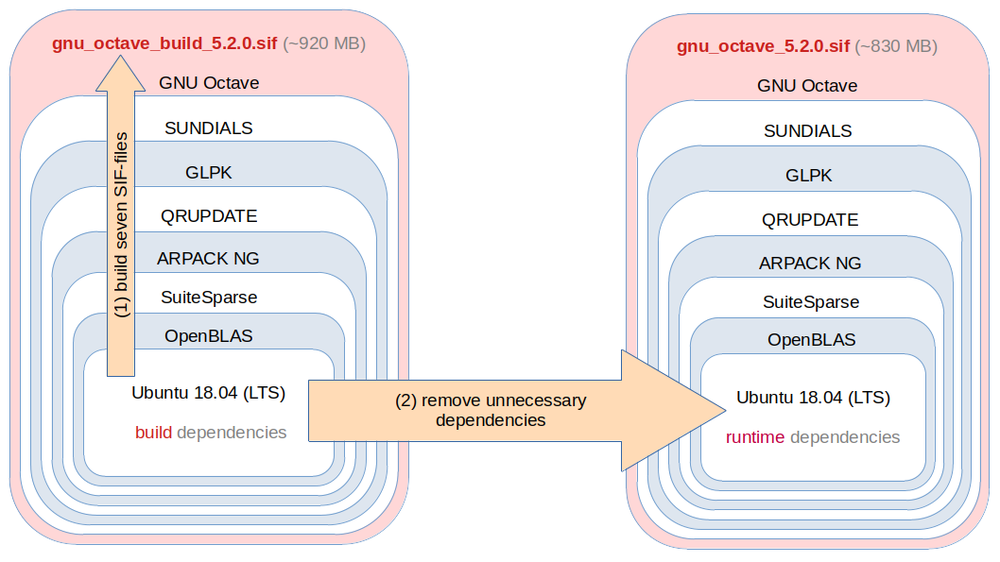

# GNU Octave ILP64 Singularity

This projects purpose is to create a [Singularity][] image of [GNU Octave][]
for high-performance computing (HPC).  [GNU Octave][] and all of it's dependent
libraries are compiled to support [ILP64][].  That means the data types
`int`, `long`, and pointers are assured to have the same size of 64-bit.
This enables computations with matrices and vectors with more than
2<sup>31</sup> elements.

[Singularity]: https://sylabs.io/singularity/
[GNU Octave]: https://www.octave.org/
[ILP64]: https://en.wikipedia.org/wiki/64-bit_computing#64-bit_data_models

> **No setup or compilation is required.**
>
> [GNU Octave][] is run from a single [SIF-file][] of about 830 MB.
>
> See all available versions in the [Singularity Library][].

[SIF-file]: https://sylabs.io/guides/3.6/user-guide/security.html#singularity-image-format-sif

The images can be pulled (downloaded) from any system having [Singularity][]
installed using the command:

[Singularity Library]: https://cloud.sylabs.io/library/siko1056/default/gnu_octave

    singularity pull library://siko1056/default/gnu_octave:5.2.0

To run [GNU Octave][] from this image, enter the following command from the
same directory:

    singularity run gnu_octave_5.2.0.sif

or

    singularity run gnu_octave_5.2.0.sif --gui

to run the graphical user interface (GUI).  The command-line interface (CLI)
version is run by:

    singularity exec gnu_octave_5.2.0.sif octave-cli

Currently available [GNU Octave][] versions are:

- `singularity pull library://siko1056/default/gnu_octave:5.2.0` (2020-01-31)
- `singularity pull library://siko1056/default/gnu_octave:5.1.0` (2019-02-23)
- `singularity pull library://siko1056/default/gnu_octave:4.4.1` (2018-08-09)


## Security and Limitations

> For more detailed information read the Singularity documentation 
> https://sylabs.io/guides/3.6/user-guide/security.html

- [Singularity][] [SIF-file][]s are run with the privileges of the currently
  active user `$USER`.  Becoming the root user is not possible.

- Only the user's home directory `$HOME` and the temporary directory `/tmp` are
  visible from the host system starting the [Singularity][] [SIF-file][].

  This avoids conflicts with installed software on the host system.  On the
  other hand this limits some of Octave's GUI features.  For HPC setups,
  running the Octave CLI version mostly, these limitations are negligible.

  Octave GUI features **not** available are:
  
  - Open URLs in the host system's web browser.  Copy and paste is necessary.
  - Open files from Octave's file browser with external applications is not
    possible (e.g. PDF documents).


## Deployment

The [Singularity][] commands to run [GNU Octave][] are quite long and hard to
remember.  In a default Linux installation of [GNU Octave][], usually the
following command-line tools are provided:

- `octave` (`--gui`)
- `octave-cli`
- `octave-config`
- `mkoctfile`

With little effort, these command-line tools can be provided by the single
Octave [SIF-file][] as well.  Assume the image is deployed at some path
`/path/to/gnu_octave_5.2.0.sif` where all intended users have read access to.
With root privileges, create for example in `/usr/local/bin` the following
script `octave` without any suffix:

```bash
#!/bin/bash

singularity exec /path/to/gnu_octave_5.2.0.sif "${0##*/}" "$@"
```

and symbolic links to that script ([`ln -s`](https://linux.die.net/man/1/ln)):

    /usr/local/bin/octave-cli    -> /usr/local/bin/octave
    /usr/local/bin/octave-config -> /usr/local/bin/octave
    /usr/local/bin/mkoctfile     -> /usr/local/bin/octave

Without root privileges, the same can be done by each individual user in
`$HOME/bin`.  This is the well-known [BusyBox approach][].  The script `octave`
invokes [Singularity][] to execute the binary inside the Octave [SIF-file][],
which is given by the respective call.  All further program arguments are
forwarded to the respective internal binary.

[BusyBox approach]: https://en.wikipedia.org/wiki/BusyBox#Single_binary


## Desktop icon

On a Linux desktop system a nice [GNU Octave][] icon can be added to
`/usr/share/applications` with root privileges or to
`$HOME/.local/share/applications` without root privileges.  The template for
the desktop-file can be obtained from the official [GNU Octave][] repository:

https://hg.savannah.gnu.org/hgweb/octave/file/release-5-2-0/etc/icons/org.octave.Octave.desktop.in

Store this file as `org.octave.Octave.desktop` in the aforementioned path and
replace `%OCTAVE_PREFIX%/bin/octave` by `octave`.  If no Octave icon is
displayed, adapt the `Icon=octave` line, as well.


## Development

The following figure summarizes the build procedure.



To create the images yourself from this repository, the following requirements
must be met:

1. [Singularity][] must be installed
2. root privileges are necessary on the build system
3. a reasonable fast internet connection (many software downloads)
4. about 10 GB of free hard disk space
5. about 2 hours of time (of course system dependent)

As root user just run `make` or `make OCTAVE_VER=5.2.0` with the desired
[GNU Octave][] from this repository's root directory.


## Development hints

It is recommended to edit `src/gnu_octave_VERSION.def` to make changes to the
final [SIF-file][] `gnu_octave_5.2.0.sif`.  For example:

- Adding or removing Ubuntu packages to support Octave Forge packages
- Make changes to the environment (variables)

Rebuilding this final image is much less time consuming.
